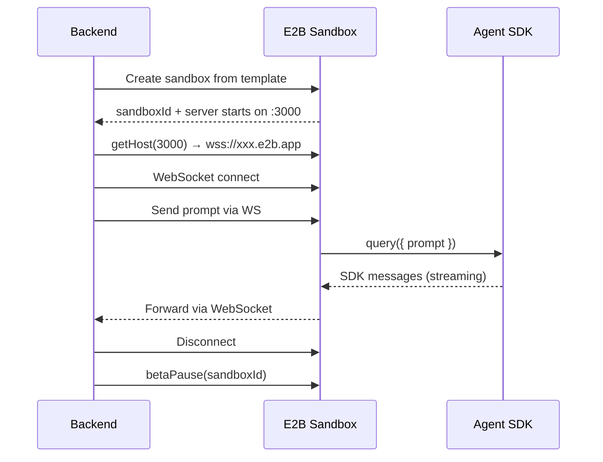

# E2B Sandbox Architecture

## Overview

E2B sandbox enables secure, isolated execution of AI agents in cloud microVMs.

## SDK Server Pattern (Recommended)



## E2B File System

Default sandbox structure:

```
/home/user/                    ← Default workdir (user: 'user')
├── workspace/                 ← Agent output files
│   ├── plan.md
│   └── report.md
├── server/                    ← Our WebSocket server
│   ├── index.ts
│   ├── package.json
│   └── node_modules/
└── .anthropic/                ← SDK creates this
```

## Key APIs

| Method | Purpose |
|--------|---------|
| `Sandbox.create(template)` | Create from template |
| `Sandbox.betaCreate(template, { autoPause: true })` | Create with auto-pause |
| `Sandbox.connect(sandboxId)` | Resume paused sandbox |
| `Sandbox.betaPause(sandboxId)` | Pause for later resume |
| `sandbox.getHost(port)` | Get public URL for port |
| `sandbox.commands.run(cmd)` | Run shell command |
| `sandbox.files.write(path, content)` | Write file |
| `sandbox.files.read(path)` | Read file |

## Template Building

```typescript
import { Template } from 'e2b';

const template = Template()
    .fromNodeImage('24')
    .setWorkdir('/home/user')
    .runCmd('npm init -y')
    .npmInstall(['@anthropic-ai/claude-agent-sdk', 'hono'])
    .copy('./server', '/home/user/server')
    .setStartCmd('cd /home/user/server && node index.js', { waitForPort: 3000 });

await Template.build(template, { alias: 'agent-sandbox' });
```

## Port Exposure

```typescript
// Server running on port 3000 inside sandbox
const host = sandbox.getHost(3000);
// → "https://sandbox-xxx.e2b.app"

// Connect via WebSocket
const ws = new WebSocket(`wss://${host}`);
```

## Environment Variables

```typescript
const sandbox = await Sandbox.betaCreate('agent-sandbox', {
    envs: {
        ANTHROPIC_API_KEY: process.env.ANTHROPIC_API_KEY,
        ANTHROPIC_MODEL: process.env.ANTHROPIC_MODEL,
    },
});
```

## Pause/Resume Pattern

```typescript
// Create and use
const sandbox = await Sandbox.betaCreate('agent-sandbox', { autoPause: true });
const sandboxId = sandbox.sandboxId;

// ... do work ...

// Pause for reuse
await Sandbox.betaPause(sandboxId);

// Resume later
const resumed = await Sandbox.connect(sandboxId);
```

## Security Considerations

- **Isolation**: Full microVM isolation
- **No local access**: Sandbox cannot touch host filesystem
- **API keys**: Passed via `envs`, not embedded in template
- **Network**: Public URLs secured via E2B authentication
