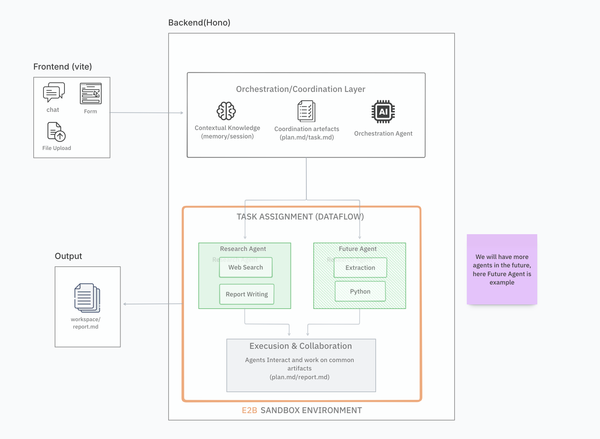

# Hybrid Architecture

## Overview

Inspired by [Manus AI](https://manus.im), our hybrid architecture separates fast orchestration from sandboxed execution.



## Manus AI Pattern

> Manus employs a multi-agent system with a planner that decomposes tasks, followed by execution in an E2B-powered Firecracker microVM sandbox. The iterative loop—analyze, plan, execute (in sandbox), observe—relies on the sandbox for actions, with persistent sessions that pause/resume as needed.

**Key insight**: Manus offers a separate "Chat Mode" for instant, sandbox-free conversations using direct LLM calls for planning/Q&A. Agent tasks activate the sandbox; planning occurs outside and execution spins up E2B only when required.

References: [E2B Blog](https://e2b.dev/blog/how-manus-uses-e2b-to-provide-agents-with-virtual-computers) | [Architecture Gist](https://gist.github.com/renschni/4fbc70b31bad8dd57f3370239dccd58f)

---

## Our Implementation

### System Components

```text
┌─────────────────────────────────────────────────────────────────────────────┐
│                              Backend (Hono)                                 │
│  ┌─────────────────────────────────────────────────────────────────────┐   │
│  │              Orchestration/Coordination Layer                        │   │
│  │  ┌──────────────────┐  ┌──────────────────┐  ┌──────────────────┐   │   │
│  │  │    Contextual    │  │   Coordination   │  │  Orchestration   │   │   │
│  │  │    Knowledge     │  │    Artifacts     │  │     Agent        │   │   │
│  │  │ (memory/session) │  │ (plan.md/task.md)│  │   (Direct LLM)   │   │   │
│  │  └──────────────────┘  └──────────────────┘  └──────────────────┘   │   │
│  └─────────────────────────────────────────────────────────────────────┘   │
│                                    │                                        │
│                       TASK ASSIGNMENT (DATAFLOW)                           │
│                                    ▼                                        │
│  ┌─────────────────────────────────────────────────────────────────────┐   │
│  │                     E2B SANDBOX ENVIRONMENT                          │   │
│  │  ┌──────────────────┐              ┌──────────────────┐             │   │
│  │  │  Research Agent  │              │   Future Agent   │             │   │
│  │  │  ┌────────────┐  │              │  ┌────────────┐  │             │   │
│  │  │  │ Web Search │  │              │  │ Extraction │  │             │   │
│  │  │  │   Report   │  │              │  │   Python   │  │             │   │
│  │  │  └────────────┘  │              │  └────────────┘  │             │   │
│  │  └──────────────────┘              └──────────────────┘             │   │
│  │                                                                      │   │
│  │           Execution & Collaboration (shared artifacts)              │   │
│  │                    (plan.md / report.md)                            │   │
│  └─────────────────────────────────────────────────────────────────────┘   │
└─────────────────────────────────────────────────────────────────────────────┘

Frontend (Vite)                                        Output
┌────────────┐                                   ┌────────────────┐
│    Chat    │ ─────── Form ──────────────────►  │   workspace/   │
│ File Upload│                                   │   report.md    │
└────────────┘                                   └────────────────┘
```

### Layer Responsibilities

| Layer | Location | Responsibility |
|-------|----------|----------------|
| **Frontend (Vite)** | `frontend/` | Chat UI, file upload, SSE stream |
| **Orchestration Layer** | `server.ts` | Session, routing, coordination |
| **Orchestration Agent** | `hybrid.ts` → `orchestratorChat` | Planning (no sandbox) |
| **E2B Sandbox** | `hybrid.ts` → `researcherExecute` | Execution (web search, code) |
| **Artifacts** | `workspace/` | plan.md, task.md, report.md |

---

## Execution Flow

```text
User: "Research AI agents and write a report"
           │
           ▼
┌──────────────────────────────────────┐
│  1. Orchestrator (Direct LLM)        │  ◄── No sandbox, instant
│     • Understands request            │
│     • Creates plan.md in workspace   │
│     • Detects: needs research        │
└──────────────────────────────────────┘
           │
           ▼
┌──────────────────────────────────────┐
│  2. Research Agent (E2B Sandbox)     │  ◄── Sandbox created here
│     • WebSearch: finds sources       │
│     • WebFetch: extracts content     │
│     • Writes report.md               │
└──────────────────────────────────────┘
           │
           ▼
┌──────────────────────────────────────┐
│  3. Orchestrator (Direct LLM)        │  ◄── No sandbox again
│     • Reads report.md                │
│     • Summarizes for user            │
└──────────────────────────────────────┘
           │
           ▼
User receives: Summary + report.md link
```

---

## Code Mapping

### 1. Hono Server (`server.ts`)

Routes requests, manages sessions, streams responses:

```typescript
// POST /api/chat → Store message, return runId
// GET /api/stream/:runId → Execute hybridAgent, stream SSE

for await (const event of hybridAgent(message, sessionId, history)) {
    await stream.writeSSE({ event: event.type, data: event.content });
}
```

### 2. Orchestration Agent (`hybrid.ts` → `orchestratorChat`)

Direct LLM call without sandbox:

```typescript
export async function* orchestratorChat(prompt, history) {
    const stream = anthropic.messages.stream({
        model: process.env.ANTHROPIC_MODEL,
        system: ORCHESTRATOR_PROMPT,  // Planning instructions
        messages: [...history, { role: 'user', content: prompt }],
    });

    for await (const event of stream) {
        yield { type: 'text', content: event.delta.text };
    }
}
```

### 3. Research Agent (`hybrid.ts` → `researcherExecute`)

E2B sandbox for execution:

```typescript
export async function* researcherExecute(task, sessionId) {
    const sandbox = await Sandbox.betaCreate({ autoPause: true });
    
    // Write agent script and run in sandbox
    await sandbox.files.write('/home/user/agent.mjs', generateScript(task));
    await sandbox.commands.run('node /home/user/agent.mjs');
    
    // Pause for reuse
    await Sandbox.betaPause(sandbox.sandboxId);
}
```

### 4. Hybrid Flow (`hybrid.ts` → `hybridAgent`)

Orchestrates the full flow:

```typescript
export async function* hybridAgent(prompt, sessionId, history) {
    // Phase 1: Orchestrator (no sandbox)
    for await (const event of orchestratorChat(prompt, history)) {
        yield { type: 'orchestrator_text', content: event.content };
        if (event.type === 'needs_sandbox') {
            // Phase 2: Researcher (E2B sandbox)
            for await (const msg of researcherExecute(task, sessionId)) {
                yield { type: 'researcher_text', content: msg };
            }
        }
    }
    // Phase 3: Summary (no sandbox)
    for await (const event of orchestratorChat(summaryPrompt, history)) {
        yield { type: 'summary_text', content: event.content };
    }
}
```

---

## Coordination Artifacts

Agents communicate via workspace files:

| File | Created By | Purpose |
|------|------------|---------|
| `plan.md` | Orchestrator | Task breakdown, approach |
| `task.md` | Orchestrator | Current task for researcher |
| `report.md` | Researcher | Research findings |
| `summary.md` | Orchestrator | Final summary for user |

---

## Performance Comparison

| Approach | "Hello" Response | Research Task |
|----------|------------------|---------------|
| **Always Sandbox** | 3-5s (sandbox boot) | 3-5s + work |
| **Our Hybrid** | Instant (no sandbox) | Instant plan + sandbox |
| **Savings** | 3-5s per simple chat | Better UX |

---

## Configuration

```bash
# Environment
SANDBOX_MODE=hybrid      # local | e2b | hybrid
ANTHROPIC_API_KEY=...
E2B_API_KEY=...
```

---

## Next Steps

- [ ] **Memory/Knowledge**: Contextual knowledge persistence
- [ ] **Session Management**: Cross-session memory
- [ ] **Custom Templates**: Pre-built E2B templates for faster startup
- [ ] **More Agents**: Extraction agent, code execution agent
