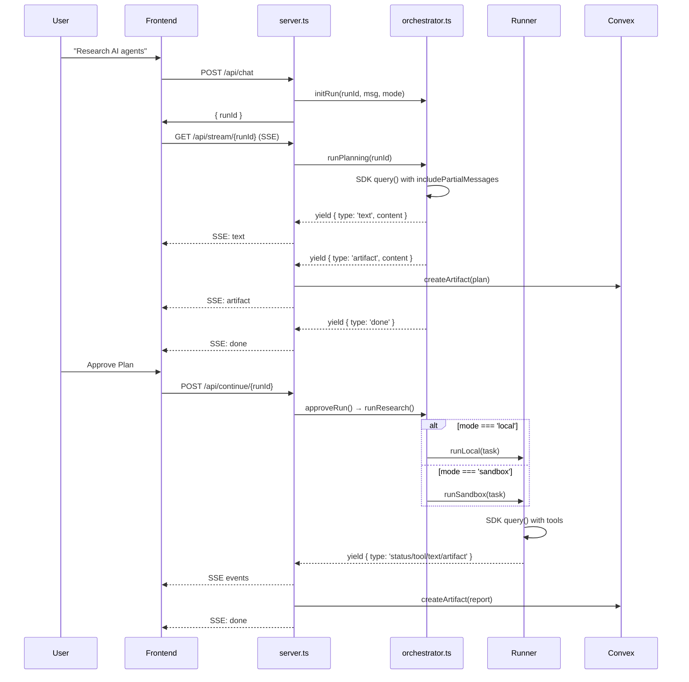

# Hybrid Architecture

## Overview

Research Agent wrapper using Claude Agent SDK. Two-phase execution with human-in-the-loop approval.

## System Diagram

```
┌─────────────────────────────────────────────────────────────────────┐
│                      FRONTEND (Vite + React)                        │
│   App.tsx: Messages, SSE Streaming, Artifact Panel                  │
└─────────────────────────────────────────────────────────────────────┘
                                    │
                         SSE (Server-Sent Events)
                                    │
                                    ▼
┌─────────────────────────────────────────────────────────────────────┐
│                      BACKEND (Hono :3001)                           │
│  server.ts                                                          │
│  ├── POST /api/chat → initRun (returns runId)                       │
│  ├── GET /api/stream/:runId → runPlanning (Phase 1)                 │
│  └── POST /api/continue/:runId → runResearch (Phase 2)              │
└─────────────────────────────────────────────────────────────────────┘
                                    │
                   ┌────────────────┴────────────────┐
                   │                                 │
                   ▼                                 ▼
        ┌──────────────────┐             ┌──────────────────┐
        │   orchestrator   │             │     Convex       │
        │   (state mgmt)   │             │   (persistence)  │
        └────────┬─────────┘             └──────────────────┘
                 │
                 ▼ Phase 2: routes based on mode
        ┌────────┴────────┐
        │                 │
        ▼                 ▼
┌───────────────┐  ┌───────────────┐
│ local-runner  │  │ sandbox-runner│
│ (SDK direct)  │  │ (E2B cloud)   │
└───────────────┘  └───────────────┘
```

---

## Two-Phase Flow

### Phase 1: Planning (orchestrator.ts)

1. User submits research request
2. Orchestrator uses SDK to generate research plan
3. Plan emitted as artifact for user review
4. User approves/edits plan

### Phase 2: Research (local-runner.ts or sandbox-runner.ts)

1. User approves plan
2. Backend routes to runner based on `mode`:
   - `local`: SDK runs directly on backend
   - `sandbox`: SDK runs in E2B microVM
3. Runner executes research with tools (WebSearch, WebFetch, Write)
4. Report emitted as artifact

---

## Sequence Diagram



---

## Backend Files

| File | Location | Purpose |
|------|----------|---------|
| `server.ts` | `backend/src/` | Hono routes, SSE streaming |
| `orchestrator.ts` | `backend/src/agents/` | State management, phase routing |
| `local-runner.ts` | `backend/src/agents/` | SDK execution on backend |
| `sandbox-runner.ts` | `backend/src/agents/` | SDK execution in E2B |
| `convex.ts` | `backend/src/lib/` | Convex HTTP client |

---

## SSE Event Types

| Event | Data | Description |
|-------|------|-------------|
| `text` | string | Text content to display |
| `artifact` | JSON | Plan or report artifact |
| `status` | string | Activity indicator |
| `tool` | JSON | Tool call info |
| `done` | - | Stream complete |
| `error` | string | Error message |

---

## Execution Modes

| Mode | Phase 1 | Phase 2 | Use Case |
|------|---------|---------|----------|
| `local` | orchestrator | local-runner | Development, simple tasks |
| `sandbox` | orchestrator | sandbox-runner | Production, complex execution |

---

## Convex Integration

Convex serves as the persistence layer:

- **threads**: Chat sessions per user
- **messages**: Chat history (user + assistant)
- **artifacts**: Plans and reports linked to threads

Artifacts are created on the backend when SSE events are emitted, ensuring persistence even if frontend disconnects.
