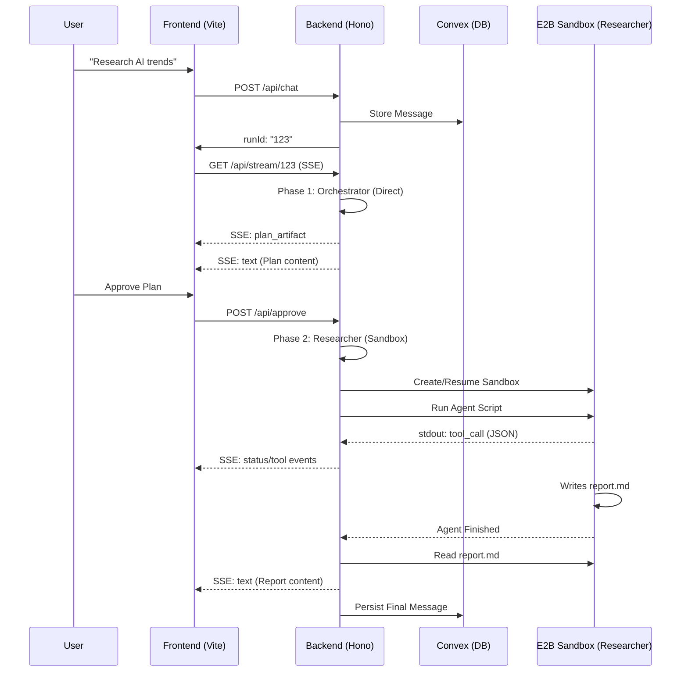

# Hybrid Architecture (v2)

## Overview

Inspired by [Manus AI](https://manus.im), our hybrid architecture separates fast orchestration from sandboxed execution. **Hybrid v2** introduces direct streaming of research reports, enhanced persistence via Convex, and real-time tool tracking.

## Core Pattern

1. **Phase 1: Orchestrator (Direct LLM)**
   - Operates outside the sandbox for maximum speed and instant response.
   - Analyzes user intent, creates a research plan, and determines if sandboxed execution is required.
   - Emits a **Plan Artifact** inline for user review/approval.

2. **Phase 2: Researcher (E2B Sandbox)**
   - Spins up an E2B microVM sandbox only when complex tasks (search, code, analysis) are needed.
   - Uses the **Claude Agent SDK** within the sandbox for autonomous tool use.
   - Emits real-time status and tool usage events to the UI.
   - Streams the final research findings directly into the chat history.

---

## Technical Architecture



---

## Key Features in v2

### 1. Direct Streaming Reports

Unlike the original architecture which treated the report as a side-panel artifact, **v2 streams the report directly as standard markdown text**.

- **Persistence**: Reports are automatically saved in the chat history.
- **Readability**: Content flows naturally within the conversation.
- **Divider-less Flow**: Smooth transition from "Thinking" status to final result.

### 2. Real-time Tool Tracking

The backend uses an **Event Queue** to parse sandbox `stdout` and yield events immediately to the UI.

- **Frontend**: The `StatusIndicator` component displays tool calls (e.g., `WebSearch`, `Write`) in real-time.
- **Shimmering Status**: Uses a Cursor-style shimmering text effect for active research.

### 3. Sandbox Hooks & Tool Interception

We use **PostToolUse** hooks in the agent script to capture file writes and tool usage.

```javascript
hooks: {
    PostToolUse: [{
        hooks: [async (input) => {
            console.log(JSON.stringify({ 
                type: 'tool_call', 
                name: input.tool_name,
                input: input.tool_input
            }));
            return {};
        }]
    }]
}
```

### 4. Session Persistence & Resumption

Sandboxes are preserved using `sandbox.betaPause()` and associated with a `sessionId` in the `sandboxStore`.

- **Resume**: If a session exists, the backend uses `Sandbox.connect()` to restore the environment.
- **Context**: The agent script uses `AGENT_SESSION_ID` to continue previous Claude Agent SDK conversations.

---

## Data Flow Summary

| Phase | Component | Location | Artifacts | Output Type |
|-------|-----------|----------|-----------|-------------|
| **1: Planning** | Orchestrator | Backend (Direct) | `plan.md` | `artifact`, `text` |
| **2: Research** | Researcher | E2B Sandbox | `report.md` | `status`, `tool`, `text` (streaming) |

---

## Persistence Layer (Convex)

Convex acts as the source of truth for:

- **Messages**: Includes both user prompts and assistant streaming responses.
- **Artifacts**: Stores Research Plans for cross-session access.
- **Snapshots**: Capture of the sandbox state when required.

---

## File Mapping

- `backend/src/sandbox/hybrid-v2.ts`: Main orchestration logic and event queue.
- `frontend/src/App.tsx`: `StatusIndicator` and streaming message rendering.
- `backend/src/prompts/`: System instructions for Orchestrator and Researcher.
